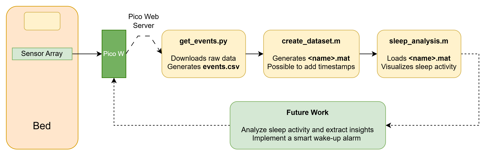
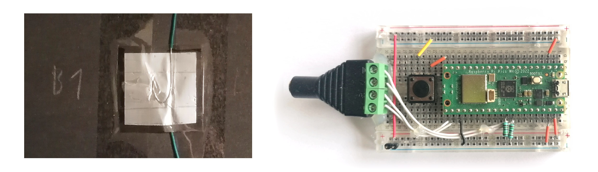
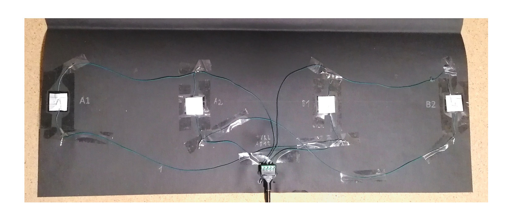
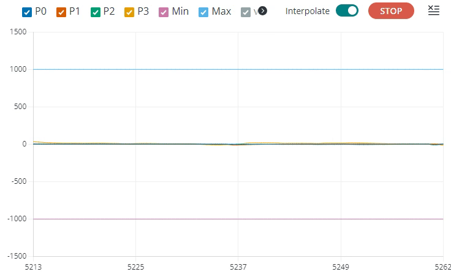
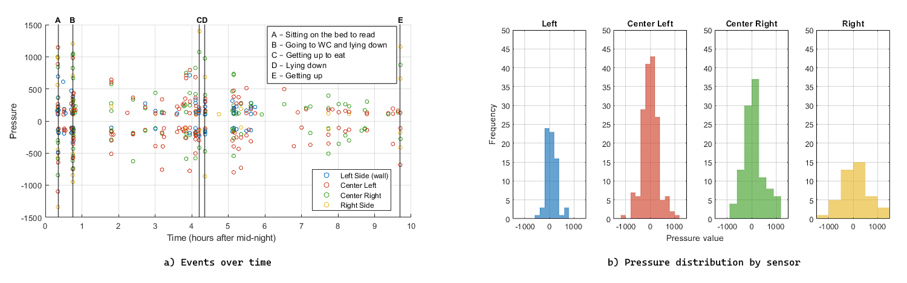

# Sleep Monitor – Real‑Time Sleep Activity Tracking

A complete sleep‑monitoring pipeline built around a **Raspberry Pi Pico W**, using **DIY pressure sensors**. It uses a **Wi‑Fi web server** for data transfer,
a **Python script** to download the data in CSV format, and **MATLAB** for visualization and analysis.
Future goals include interpreting the data and developing a smart alarm that wakes the user during light‑sleep phases

---

## 📌 Project Overview
The system collects pressure deltas in four different positions on a mattress during sleep, and stores it for later analysis.  
The figure below summarizes the full workflow:

---

## Software Requirements
- Arduino IDE 2.x + Raspberry Pi Pico Board 4.5.2 or later
- Python 3 with `requests` (`pip install requests`)
- MATLAB 2019a or later

## 🧩 Components
### Raspberry Pi Pico W + Firmware (Arduino IDE C++)
- Sensor calibration
- Reads the pressure‑sensor matrix  
- Detects and stores movement events  
- Serves a Wi‑Fi web server for data transfer in CSV format 

### DIY Pressure Sensors
- Based on *velostat*, a pressure‑dependent resistive sheet material  
- Each sensor is a 3cm × 3cm velostat square between two 2.5cm × 2.5cm aluminum‑foil electrodes  
- Resistance varies with applied pressure  
- Four sensors are placed under the mattress at torso height  
- Although physically in a line, they are electrically connected in matrix form to reduce wiring  

## Circuit Assembly

- Each sensor is modeled as a resistor (pressure dependent).
- To build a sensor, cut a 3cm × 3cm square from a velostat sheet, and place it between two 2.5cm × 2.5cm aluminum‑foil electrodes
- Two external 1.5 kΩ resistors connected between GP26/27 and GND are needed to provide a correct reference.
- Other values in the range 0.5kΩ to 5kΩ can be used: edit `#define R0 1.5` in `Sensors.h`
- Working principle: SENSOR_LINE_1/2 are alternately driven to Vcc and GND, while measuring SENSOR_COL_A/B voltages.
- The system of 4 equations and 4 unknowns (resistances) is solved iteratively in Sensors.cpp/h.
- **Optional:** A switch allows to turn ON/OFF the Wi-Fi. You can also use the serial-monitor command **w** to toggle Wi-Fi state, indicated by the built-in LED.

  
   
  <em>a) Sensor detail &emsp;&emsp;&emsp;&emsp;&emsp;&emsp;  b) Breadboard assembly</em>

  
   
  <em>Sensors connected in matrix form</em>

---

## 🚀 How to Run
### Wi-Fi setup
- To set up Wi-Fi, edit your credentials **char ssid[]** and **char password[]** in WiFiControl.cpp. Alternatively, create a different .cpp file and place them there (no need for .h).
- When you power the Pico W, it will try to connect to your Wi-Fi. Using a serial monitor, you can view its progress
- If Wi-Fi successfully connects, the IP running the web server will be printed; For example: IP: 192.168.1.21
- The built‑in LED in the Pico W shows the Wi-Fi status

### User Commands for Serial Monitor
- **W** - Toggle Wi-Fi state ON/OFF. The built-in LED switches according to Wi-Fi State
- **P** - Prints the sensor readings in real-time. Useful to view in graph format with the Arduino IDE Serial Plotter.
- **CS** - Start the calibration process (instructions below)
- **CE** - End the calibration process (instructions below)
- **E** - Prints recorded Events in raw MATLAB format: [time (seconds) , sensor ID (0 to 3) , pressure]

### Calibration
- The code comes with a default calibration based on prescribed dimensions, so it's not mandatory to calibrate it, although it's useful to compensate individual differences between sensors
- The sensor array should be in its final position under the mattress
- Use **CS** to start the calibrating proccess. If Wi-Fi is OFF, the built-in LED will turn ON.
- Press and release the mattress in each of the 4 sensor positions in sequence.
- Apply approximately the same pressure in all four sensor positions
- Use **CE** to end the calibrating process.
#### Note
- The calibration algorithm adjusts the sensitivity of each sensor in order to map the same pressure applied during calibration to the value of 1000
- The calibration is stored in permanent memory, so you don't need to recalibrate every time you power the Pico W
### Real-Time Sensor Visualization
- Using **P** in the serial monitor activates real‑time printing of sensor data
- Open the Arduino IDE serial plotter to view in graphical format
- Below is an example of the serial plotter

  
   
  <em>Serial plotter during calibration</em>

---

## 🧪 Data Transfer and Analysis Tools
### 1 - Downloading the Events
- Make sure the Pico W web server is ON by checking the LED status
- Make sure your Python has `requests` installed
- Run `analysis/get_events.py` to download the data and create `events.csv`
#### Note
- `get_events.py` searches for local web servers that respond to 192.168.1.x/events, with x from 1 to 64, as it very likely is in that range
- Whenever you turn ON the Wi-Fi, it's IP is printed on the serial monitor
- If you know the IP, you can view the data in the browser by accessing http://IP/events

### 2 - Creating a .mat dataset
- Use MATLAB script `analysis/create_dataset.m` to convert raw CSV logs in `events.csv` to the `.mat` format.
- Select a name by editing `output_name = 'example_name.mat'`.
- Optionally,  you can add timestamps by editing `labels` and `labels_time`

### 3 - Visualizing the data
- Running `analysis/sleep_analysis.m` will load the `.mat` file and generate:
  - Plot of pressure over time  
  - Annotated events (if present in the file)
  - Histogram of pressure distribution
  
#### Note:
- If you don't have a dataset, you can test the visualization with `dataset/synthetic_sleep.mat`

### Example Outputs

---

